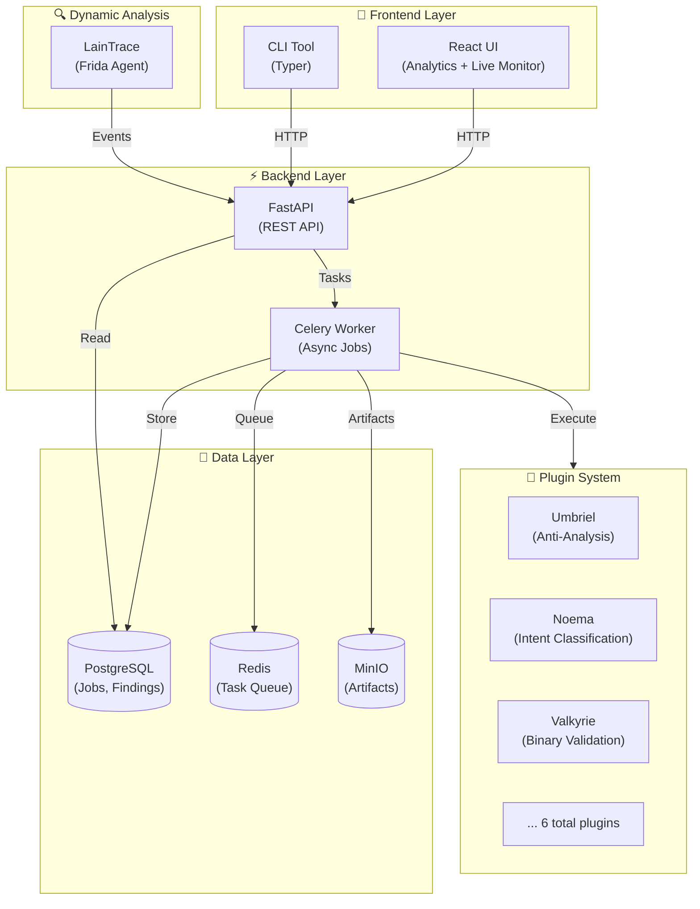

<!--
 █████╗ ███████╗████████╗██╗  ██╗███████╗██████╗ ███████╗██████╗  █████╗ ███╗   ███╗███████╗
██╔══██╗██╔════╝╚══██╔══╝██║  ██║██╔════╝██╔══██╗██╔════╝██╔══██╗██╔══██╗████╗ ████║██╔════╝
███████║███████╗   ██║   ███████║█████╗  ██████╔╝█████╗  ██████╔╝███████║██╔████╔██║███████╗
██╔══██║╚════██║   ██║   ██╔══██║██╔══╝  ██╔══██╗██╔══╝  ██╔══██╗██╔══██║██║╚██╔╝██║╚════██║
██║  ██║███████║   ██║   ██║  ██║███████╗██║  ██║███████╗██║  ██║██║  ██║██║ ╚═╝ ██║███████║
╚═╝  ╚═╝╚══════╝   ╚═╝   ╚═╝  ╚═╝╚══════╝╚═╝  ╚═╝╚══════╝╚═╝  ╚═╝╚═╝  ╚═╝╚═╝     ╚═╝╚══════╝
-->

<p align="center">
  
</p>

<h1 align="center">⚡ AetherFrame ⚡</h1>
<h3 align="center">"Advanced Malware Analysis with Hybrid Monorepo Architecture"</h3>

<p align="center">
  
  
  
  
  
  
  
  
</p>

## 🎬 Ecosystem Showcase

<p align="center">
  <strong>🌐 Complete Ecosystem Tour</strong><br/>
  
</p>

<p align="center">
  <strong>📖 Interactive API Documentation</strong><br/>
  
</p>

---

## 📥 Download

### Desktop Applications

<p align="center">
  <a href="https://github.com/ind4skylivey/aetherframe/releases/latest">
    
  </a>
  <a href="https://github.com/ind4skylivey/aetherframe/releases/latest">
    
  </a>
</p>

<p align="center">
  <a href="https://github.com/ind4skylivey/aetherframe/releases/latest">
    
  </a>
  <a href="https://github.com/ind4skylivey/aetherframe/releases/latest">
    
  </a>
  <a href="https://github.com/ind4skylivey/aetherframe/releases/latest">
    
  </a>
</p>

<p align="center">
  <strong>👉 <a href="https://github.com/ind4skylivey/aetherframe/releases/latest">Download Latest Release</a></strong>
</p>

### Installation

**Linux:**

```bash
# AppImage (portable)
chmod +x aetherframe_*.AppImage
./aetherframe_*.AppImage

# Debian/Ubuntu
sudo dpkg -i aetherframe_*.deb
aetherframe
```

**macOS:**

```bash
# Open .dmg file
# Drag AetherFrame.app to Applications
# Launch from Applications folder
```

**Windows:**

```
# Run installer (.exe or .msi)
# Follow installation wizard
# Launch from Start Menu
```

---

## 🔥 Why AetherFrame?

- 🚀 **Automated Analysis Pipelines** - Plugin-based orchestration with FastAPI + Celery + Redis
- 🛡️ **Advanced Threat Detection** - 50+ anti-analysis techniques, behavioral patterns, obfuscation
- 🎯 **Frida-Powered Tracing** - Live runtime introspection and instrumentation (LainTrace)
- ⚙️ **Zero-Setup Stack** - Docker Compose with Postgres + MinIO + Redis pre-configured
- 📊 **Real-Time Analytics** - Interactive dashboards with 6 chart types (Recharts)
- 🌌 **Full Observability** - `/status` endpoint, event streams, auto-refresh UI
- 🧩 **Hybrid Monorepo** - Independent packages, plugins, and modules
- 🎨 **Premium UI/UX** - Dark theme with glassmorphism and live monitoring

<p align="center">
  
</p>

---

## 🚀 Quick Start

### One-Command Launch

```bash
# Clone repository
git clone git@github.com:ind4skylivey/aetherframe.git
cd aetherframe

# Start everything
./start.sh
```

**Access Points:**

- 🌐 **Web UI**: http://localhost:3000
- 🔍 **API Docs**: http://localhost:3000/api/docs
- 💾 **MinIO Console**: http://localhost:9001

### Alternative: Development Mode

```bash
# Backend
cd packages/core
docker compose up -d

# Frontend (in another terminal)
cd packages/frontend
npm install
npm run dev
```

---

## 🧠 Architecture

### System Overview



### Monorepo Structure

```
aetherframe/
├── packages/              # Core packages
│   ├── core/             # Backend (FastAPI, Celery, DB)
│   ├── frontend/         # Web UI (React + Vite)
│   └── cli/              # CLI tool (Typer)
├── plugins/              # Analysis plugins
│   ├── umbriel/          # Anti-analysis detection
│   ├── noema/            # Intent classification
│   ├── valkyrie/         # Binary validation
│   ├── mnemosyne/        # State reconstruction
│   ├── static_analyzer/  # Static analysis
│   └── laintrace/        # Dynamic tracing
├── shared/               # Shared resources
│   ├── schemas/          # Common schemas
│   ├── types/            # TypeScript types
│   └── configs/          # Configurations
└── tools/                # Development tools
    ├── plugin-sdk/       # Plugin development kit
    └── testing/          # Testing utilities
```

---

## 📦 Features

### Backend (FastAPI + Celery)

- **Pipeline Orchestration**

  - Modular plugin system
  - Configurable analysis stages
  - Conditional execution
  - Async task processing with Celery

- **Detection Engines**

  - **Umbriel**: Anti-debugging, anti-VM, anti-Frida detection (50+ techniques)
  - **Noema**: Intent classification and behavioral analysis
  - **Valkyrie**: Binary validation and integrity checks
  - **Static Analyzer**: Comprehensive static analysis
  - **LainTrace**: Dynamic tracing with Frida instrumentation
  - **Mnemosyne**: State reconstruction from memory dumps

- **Data Management**
  - PostgreSQL for structured data (jobs, findings, artifacts)
  - MinIO for artifact storage (JSON, HTML, binary reports)
  - Redis for task queue and caching
  - Alembic for database migrations

### Frontend (React + Vite)

- **Six Main Views**

  - **Dashboard**: System overview and recent jobs
  - **Analytics**: 6 interactive charts with threat intelligence
  - **Launch**: Interactive pipeline submission interface
  - **Job Details**: Comprehensive analysis results
  - **Findings**: Filterable threat browser with severity indicators
  - **Artifacts**: Downloadable reports gallery

- **Visualizations** (Recharts)

  - Severity distribution (Pie chart)
  - Category breakdown (Bar chart)
  - Job timeline (Line chart)
  - Threat radar (Radar chart)
  - Risk score trends (Line chart)
  - Confidence distribution (Bar chart)

- **Real-Time Features**
  - LiveMonitor sidebar with auto-refresh (5s)
  - System health indicators
  - Live metrics counters
  - Hot Module Replacement (HMR) for development

---

## 🎯 Pipeline Types

| Pipeline          | Description                                    | Speed  | Depth      | Use Case            |
| ----------------- | ---------------------------------------------- | ------ | ---------- | ------------------- |
| **quicklook**     | Fast triage with anti-analysis detection       | ⚡⚡⚡ | ⭐         | Initial assessment  |
| **deep-static**   | Comprehensive static analysis + decompilation  | ⚡⚡   | ⭐⭐⭐     | Detailed inspection |
| **dynamic-first** | Runtime analysis with Frida instrumentation    | ⚡     | ⭐⭐⭐⭐   | Behavioral analysis |
| **full-audit**    | Complete: static + dynamic + ML classification | ⚡     | ⭐⭐⭐⭐⭐ | Full investigation  |

---

## 🔧 Installation

### Prerequisites

- Docker & Docker Compose
- Node.js 16+ & npm (for frontend development)
- Python 3.11+ (for backend development)

### All-in-One (Recommended)

Uses Docker Compose with all services in one container:

```bash
./start.sh
```

### Manual Setup

**Backend:**

```bash
cd packages/core
docker compose up -d  # Start dependencies
pip install -r requirements.txt
uvicorn aetherframe.main:app --reload
```

**Frontend:**

```bash
cd packages/frontend
npm install
npm run dev
```

**Plugins:**

```bash
# Install specific plugins
pip install -e plugins/umbriel
pip install -e plugins/noema

# Or install all
python scripts/install-all.py
```

---

## 📊 API Endpoints

### System

- `GET /status` - System health and metrics
- `GET /metrics` - Prometheus metrics

### Jobs

- `GET /jobs` - List all jobs
- `GET /jobs/{id}` - Get job details
- `POST /jobs` - Submit new analysis job
- `GET /jobs/{id}/findings` - Get job findings
- `GET /jobs/{id}/artifacts` - Get job artifacts
- `GET /jobs/{id}/events` - Get job events

### Global Queries

- `GET /findings` - All findings across jobs
- `GET /artifacts` - All artifacts
- `GET /plugins` - List available plugins

**Interactive Docs**: http://localhost:8000/docs

<p align="center">
  
</p>

---

## 🧩 Plugin Development

### Create a Plugin

```python
# plugins/my_plugin/plugin.py
from aetherframe.plugins.base import BasePlugin

class MyPlugin(BasePlugin):
    def analyze(self, target: str) -> dict:
        return {
            "findings": [...],
            "artifacts": [...],
            "metadata": {...}
        }
```

### Register Plugin

```yaml
# plugins/my_plugin/plugin.yaml
name: my_plugin
version: 1.0.0
description: My custom analysis plugin
author: your-name
entry_point: my_plugin.plugin:MyPlugin
```

### Install Plugin

```bash
cd plugins/my_plugin
pip install -e .
```

See [Plugin SDK](./tools/plugin-sdk/) for full documentation.

---

## 🎨 Screenshots

### Analytics Dashboard

Modern analytics with interactive charts, threat intelligence, and real-time metrics.

### Live Monitoring

Auto-refreshing sidebar showing system health, active jobs, and latest findings.

### Job Details

Comprehensive view with tabbed interface for findings, artifacts, and trace events.

---

## 🔄 Development Workflow

### Make Changes

```bash
# Backend
cd packages/core
# Edit code
pytest  # Run tests

# Frontend
cd packages/frontend
# Edit code
npm run dev  # Auto-reload

# Plugin
cd plugins/umbriel
# Edit code
pytest tests/
```

### Database Migrations

```bash
cd packages/core
alembic revision --autogenerate -m "Description"
alembic upgrade head
```

### Build for Production

```bash
# Frontend
cd packages/frontend
npm run build

# Docker all-in-one
docker compose -f docker-compose.allinone.yml build
```

---

## 🗺️ Roadmap

### ✅ Completed

- [x] Backend pipeline orchestration
- [x] Plugin system architecture
- [x] React frontend with routing
- [x] Analytics dashboard with charts
- [x] Real-time monitoring
- [x] Docker all-in-one setup
- [x] Hybrid monorepo structure

### 🚧 In Progress

- [ ] Desktop packaging (Tauri)
- [ ] WebSocket real-time updates
- [ ] Job comparison tool

### 💡 Future

- [ ] ML-powered threat classification
- [ ] Multi-user authentication
- [ ] Cloud deployment automation
- [ ] Mobile companion app
- [ ] Plugin marketplace

---

## 📄 License

This project is licensed under the MIT License - see the [LICENSE](LICENSE.txt) file for details.

---

## 🙏 Acknowledgments

- FastAPI for the excellent web framework
- Celery for robust task processing
- Recharts for beautiful visualizations
- Frida for dynamic instrumentation
- PostgreSQL, Redis, and MinIO teams

---

## 📞 Contact

**Author**: [@ind4skylivey](https://github.com/ind4skylivey)
**Repository**: [aetherframe](https://github.com/ind4skylivey/aetherframe)

---

<div align="center">

[⬆ back to top](#-aetherframe-)

</div>
